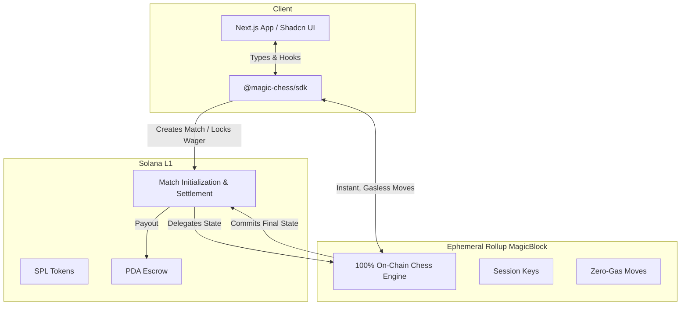

<div align="center">
  
  
  # ♟️✨ Magic Chess
  
  **The first 100% on-chain, gasless, real-time chess engine on Solana.**
  
  [](https://github.com/amalnathsathyan/magic-chess)
  [](https://magicblock.gg)
  [](https://solana.com)
</div>

<br/>

**🎮 Live Demo:** [arena.chessmagic.workers.dev](https://arena.chessmagic.workers.dev/)

<br/>

**Magic Chess** is a decentralized, trustless chess arena built on Solana. By leveraging **MagicBlock's Ephemeral Rollups (ER)**, we deliver a seamless, traditional Web2 chess experience—featuring **50ms latency** and **0 gas fees**—while retaining the security, immutability, and wager capabilities of Web3.

Whether you're a builder, a player, or a judge, Magic Chess showcases the cutting edge of what's possible with Solana's composability and MagicBlock's infrastructure.

---

## 📑 Table of Contents
- [🌟 Key Highlights](#-key-highlights)
- [🤖 AI Agent Integrations](#-ai-agent-integrations)
- [🏗️ Architecture](#-architecture)
- [🚀 Quick Start](#-quick-start)
- [📦 Repository Structure](#-repository-structure)
- [🤝 For Judges & Builders](#-for-judges--builders)

---

## 🌟 Key Highlights

### ⚡ 100% On-Chain & Gasless (Ephemeral Rollups)
The *entire FIDE rulebook* is enforced on-chain. Castling, en passant, promotions, check/checkmate, stalemate, and the 50-move rule are computed directly on the Ephemeral Rollup (ER).
- **🏎️ 50ms Latency:** Moves are executed instantly on the ER validator.
- **💸 Zero Gas:** MagicBlock enables gasless interactions. Sign a session key *once* and play an entire match without wallet popups.
- **🔒 No Compromises:** State commits back to the Solana L1 seamlessly for final settlement.

### 💰 Trustless Wagers & Automated Payouts
Wager any SPL token on your matches.
- **PDA Escrow:** Tokens are securely locked in a Program Derived Address (PDA) escrow.
- **Automated Settlement:** The smart contract handles payouts automatically (Winner takes all, minus a configurable platform fee; Draws refund both players).

### 🔮 Parimutuel Prediction Markets
Spectators can get in on the action!
- **Trustless Parimutuel System:** Bet on White, Black, or Draw. 
- **Instant Distribution:** Payouts are proportionally distributed to the winning pool immediately after game settlement.

---

## 🤖 AI Agent Integrations

Magic Chess is built from the ground up to be **AI-friendly**. We envision a future where autonomous agents can seamlessly create matches, join games, and participate in prediction markets.

- **Agent Framework Ready:** The `@magic-chess/sdk` makes it incredibly easy for TypeScript-based AI frameworks (e.g. LangChain, Eliza) to wrap game logic.
- **Headless ER Routing:** Agents can dynamically discover Ephemeral Rollup endpoints and route transactions instantly without human intervention.
- **Direct Anchor Access:** Python or Rust-based AI agents can bypass the SDK entirely and interact directly via standard Anchor IDLs (`anchorpy`), as the L1/L2 routing logic is fully encapsulated on-chain.

---

## 🏗️ Architecture



---

## 🚀 Quick Start

### Prerequisites
- Node.js 18+
- Rust 1.89+
- Solana CLI 4.1+
- Anchor CLI 1.1.2
- Yarn

### 1. Installation

```bash
git clone https://github.com/amalnathsathyan/magic-chess.git
cd magic-chess
yarn install
```

### 2. Build & Test

```bash
# Navigate to the program directory
cd magic-chess-program

# Build the Anchor program
cargo build-sbf --tools-version v1.52

# Run all 205 tests (182 pure Rust + 23 LiteSVM + 8 Mollusk CU + 12 Anchor TS)
cargo test -p magic_chess
cargo test -- litesvm
cargo test --features integration-tests -p magic_chess --test cu_benchmarks
anchor test
```

---

## 📦 Repository Structure

This is a fully open-source monorepo showcasing how to build a scalable, real-time gaming application on Solana.

| Directory | Description |
|-----------|-------------|
| 🦀 **`magic-chess-program/`** | The core Anchor program (Rust). Features 22 instructions, complete FIDE validation, and token escrow logic. |
| 🛠️ **`sdk/`** | `@magic-chess/sdk`, an easy-to-use TypeScript library with React hooks and MagicBlock routing wrappers. |
| 🎨 **`frontend/`** | A sleek Next.js 15 Web App using Tailwind CSS and Radix UI. Built for instantaneous gameplay via Jotai state management. |

---

## 🤝 For Judges & Builders

Magic Chess isn't just a game—it's a demonstration of **Solana's future in high-frequency, logic-heavy apps**.

We heavily utilized MagicBlock Ephemeral Rollups to offload state mutation limits, bypassing traditional L1 congestion entirely. The codebase is heavily documented and rigorously tested (205 tests across unit, integration, and performance benchmarking).

**Explore our extensive documentation:**
- 📜 [Detailed Specification](https://amalnathsathyan.github.io/magic-chess/docs/spec)
- 🏗️ [Architecture Deep-Dive](https://amalnathsathyan.github.io/magic-chess/docs/architecture)
- 🛡️ [Security Audit & Report](https://amalnathsathyan.github.io/magic-chess/docs/security-audit)
- 🔌 [SDK Reference](https://amalnathsathyan.github.io/magic-chess/docs/sdk)

---

## 📄 License

This project is open-source and available under the **MIT License**. Build on top of it, fork it, and help us push the boundaries of on-chain gaming!
