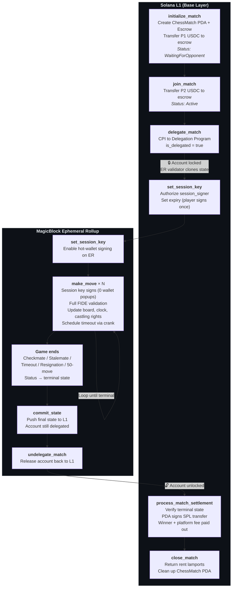

# Magic Speed Chess

An on-chain chess engine on Solana with gasless, zero-confirmation gameplay powered by [MagicBlock](https://magicblock.gg) Ephemeral Rollups.

Full documentation at [docs.magicchess.com](https://docs.magicchess.com): [SDK](https://docs.magicchess.com/sdk) · [MagicBlock](https://docs.magicchess.com/magicblock) · [Deployment](https://docs.magicchess.com/deployment)

## Features

- **Complete FIDE chess logic** — all piece moves, castling, en passant, promotion, check, checkmate, stalemate, 50-move rule, and threefold repetition detection
- **Two game modes** — Blitz (3 min/move) and Standard (15 min/move), configurable per match
- **Wager matches** — SPL token escrow with automated payout (winner takes pot minus platform fee; draw refunds both players)
- **MagicBlock gasless gameplay** — all chess moves execute on the Ephemeral Rollup with zero gas and zero wallet popups
- **Session keys** — sign once per match, then play every move seamlessly via hot-wallet signing
- **Crank automation** — timeout detection, settlement, and undelegation handled automatically; no off-chain bot needed
- **Prediction markets** — spectators bet on match outcomes (future)
- **TypeScript SDK** (`@magic-chess/sdk`) — React hooks, FEN utilities, PDA helpers, and MagicBlock connection routing

---

## Architecture

Magic Speed Chess uses MagicBlock Ephemeral Rollups to split game state between Solana L1 (where tokens and final settlement live) and an Ephemeral Rollup validator (where all chess moves execute with instant finality). Tokens never leave L1; the ER handles only gameplay logic.

### L1 / Ephemeral Rollup Flow



**Two PDAs per match:**
- `chess_match` (seeds: `["chess_match", match_id]`) — stores full game state including board, players, status, clock, castling rights, and token configuration
- `match_escrow` (seeds: `["match_escrow", match_id]`) — SPL token account owned by the ChessMatch PDA, holding both players' wagers

**State machine:** `WaitingForOpponent` → `Active` → Terminal (`WhiteWins`, `BlackWins`, `Draw`) — strictly one-way, no reversals.

### L1 / ER Table

```
                    L1 (Solana)                              ER (MagicBlock)
                    =========                                ================

initialize_match                                              [inactive]
  - Creates ChessMatch PDA
  - Creates escrow token PDA
  - Transfers P1 USDC → escrow
  - game_status = WaitingForOpponent

join_match                                                    [inactive]
  - Transfers P2 USDC → escrow
  - game_status = Active

delegate_match ──────🔒────────────────────────────────────── ChessMatch delegated
  - CPI to Delegation Program                                  - Account locked on L1
  - is_delegated = true                                        - ER validator clones state

[inactive]                                                    set_session_key (once per player)
                                                                - Sets session_signer + expiry

[inactive]                                                    make_move × N
                                                                - Session key signs (0 popups)
                                                                - Chess logic validated
                                                                - Board state updated
                                                                - Schedule timeout via crank

[inactive]                                                    game ends
                                                                - Checkmate / Stalemate /
                                                                  Timeout / Resignation
                                                                - game_status → terminal state

[inactive]                                                    commit_state
                                                                - Pushes state to L1
                                                                - Account still delegated

[inactive]                                                    undelegate_match ──🔓──→

process_match_settlement
  - Verifies terminal state
  - PDA signs SPL transfer
  - USDC distributed: winner + platform fee
  - payout_processed = true

close_match
  - Returns rent lamports
  - Cleans up ChessMatch PDA
```

---

## MagicBlock Integration Overview

MagicBlock Ephemeral Rollups enable gasless, low-latency chess by delegating match accounts from Solana L1 to an ER validator. During gameplay, all moves execute on the ER with ~50ms confirmation and zero transaction fees. When the game concludes, final state is committed back to L1 for settlement.

| Capability | Without MagicBlock | With MagicBlock |
|---|---|---|
| Move latency | ~400ms (L1 block time) | ~50ms (ER instant finality) |
| Move cost | ~$0.000005 SOL / move | **FREE** |
| Wallet popups per match | 2 + N moves (20-80+) | 4 total (independent of move count) |
| Timeout / settlement | Manual or custom bot | Automatic via crank scheduler |

### Delegation Lifecycle

1. **Delegate** — `delegate_match` locks the ChessMatch PDA on L1. The MagicBlock ER validator clones the account state.
2. **Play** — All `make_move`, `resign_game`, and `claim_timeout_win` instructions execute on the ER. Session keys sign moves without wallet prompts.
3. **Commit** — `commit_state` writes the final ER state back to the L1 account. Up to 10 free commits per delegated account.
4. **Undelegate** — `undelegate_match` releases the account, re-enabling normal L1 access for settlement.

### Key Program Addresses

| Program | Address |
|---|---|
| Delegation Program | `DELeGGvXpWV2fqJUhqcF5ZSYMS4JTLjteaAMARRSaeSh` |
| Task Scheduler (crank) | `Magic11111111111111111111111111111111111111` |
| Session Keys | `KeyspM2ssCJbqUhQ4k7sveSiY4WjnYsrXkC8oDbwde5` |

### ER Validator Endpoints (Devnet)

| Region | Endpoint |
|---|---|
| US | `https://devnet-us.magicblock.app` |
| EU | `https://devnet-eu.magicblock.app` |
| Asia | `https://devnet-as.magicblock.app` |

---

## Gas Model

Costs are split across three layers: user-paid L1 instructions, MagicBlock-sponsored ER operations, and MagicBlock-sponsored settlement.

| Step | Layer | Cost | Sponsor |
|---|---|---|---|
| `initialize_match` | L1 | ~$0.000005 SOL | User (via Privy embedded wallet) |
| `join_match` | L1 | ~$0.000005 SOL | User (via Privy embedded wallet) |
| `delegate_match` | L1 | ~$0.001 SOL | Platform (Privy gas sponsorship) |
| All chess moves (`make_move`) | ER | **$0 (FREE)** | MagicBlock |
| `commit_state` | ER → L1 | **$0 (10 free)** | MagicBlock |
| `undelegate_match` | ER → L1 | ~$0.06 SOL | MagicBlock |
| `process_match_settlement` | L1 | ~$0.000005 SOL | User / Platform |
| **Total per match** | | **~$0.07** | Platform |

### Sustainability

At a $1 average wager with a 2% platform fee ($0.02 revenue per match), the platform breaks even at ~4 matches/day. At scale (1,000+ matches/day), the per-match cost becomes negligible against revenue.

---

## Token Flow

```
P1 Wallet ──USDC──> match_escrow PDA ──USDC──> Winner Wallet
P2 Wallet ──USDC──> match_escrow PDA ──USDC──> Platform Fee Wallet
```

- **USDC locked in L1 escrow PDA** — never leaves Solana L1, never touches the Ephemeral Rollup
- **ER handles ONLY game state** — board position, moves, clock, game status
- **No Ephemeral SPL Token escrow needed** — the ER does not hold or transfer tokens
- **Settlement on L1 after undelegation** — PDA signs SPL transfer using stored seed + bump
- **Double-payout prevention** — `payout_processed` flag on ChessMatch, checked before every transfer

---

## Session Key Scope

Session keys eliminate wallet popups during gameplay. Each player authorizes a session keypair once; that keypair signs all subsequent moves.

| Instruction | Wallet Only | Session Key Allowed |
|---|---|---|
| `make_move` | — | ✅ Yes |
| `resign_game` | ✅ Yes | ❌ No |
| `claim_timeout_win` | ✅ Yes | ❌ No |
| `set_session_key` | ✅ Yes | ❌ No |
| `revoke_session_key` | ✅ Yes | ❌ No |
| `delegate_match` | ✅ Yes | ❌ No |
| `undelegate_match` | ✅ Yes | ❌ No |
| `process_match_settlement` | ✅ Yes | ❌ No |

Session keys are scoped per-match, cannot manage funds, and expire at a configurable timestamp (typically 24 hours or match end). Keys are stored client-side in IndexedDB for persistence across browser sessions.

---

## Signing Flow (Player 1)

A complete match from Player 1's perspective requires only **4 wallet confirmations** regardless of how many moves are played.

| Step | Wallet Confirmations |
|---|---|
| `initialize_match` — create match, escrow USDC | 1 |
| `delegate_match` — lock account to MagicBlock | 1 |
| `set_session_key` — authorize hot wallet | 1 |
| All moves (`make_move` × N) | 0 (session key) |
| `process_match_settlement` — claim winnings | 1 |
| **Total** | **4** |

Player 2 follows the same model: 1 confirmation for `join_match`, 1 for `set_session_key`, 0 for moves, 1 for settlement = **3 total**.

---

## Crank Automation

MagicBlock's Task Scheduler (`Magic1111...`) automates the full game lifecycle — no custom off-chain bot required.

```
make_move
  └── schedule_timeout(task_id)          # Check timeout at now + moveTimeoutDuration

Opponent moves before timeout
  └── cancel_timeout_task(old_task_id)   # Cancel old timer
  └── schedule_timeout(new_task_id)      # Schedule new timer for other player

Timeout fires (opponent did not move)
  └── crank executes claim_timeout_win()
      └── Inside claim: schedule process_match_settlement
          └── Crank executes settlement (payouts)
              └── Inside settlement: schedule undelegate_match
                  └── Crank commits state → undelegates → match complete
```

This means players never need to manually call `claim_timeout_win` or `process_match_settlement`. The entire pipeline from timeout to payout is automated.

---

## Key Technical Decisions

These decisions were validated through 18 agent research passes across the full stack (see `agent-findings/`).

| Decision | Rationale |
|---|---|
| **Anchor 1.1.2** | Latest stable; required by `ephemeral-rollups-sdk` 0.16.2 and `magicblock-magic-program-api` 0.10.1 |
| **Devnet first, ER after frontend is functional** | Validate core chess + wagering on L1; layer in gasless ER gameplay as Phase 2 with no contract changes |
| **Zero-bet "friendly" mode** | 3-line change: set `MIN_BET_AMOUNT = 0` + guard transfer instructions when amount is 0 |
| **Next.js 15 + PWA** | Web-first for hackathon; PWA for near-native mobile experience without React Native overhead |
| **Privy for auth** | Google/email login → embedded Solana wallet; recommended by MagicBlock; TEE-based delegated actions; used by Pump.fun, Jupiter, Tensor |
| **Custom chess board (react-chessboard v5)** | Full control over styling, animations, and move validation display |
| **Jotai for state** | Atomic state management; simpler than Redux for component-scoped game state |
| **Tokens stay on L1, ER = game engine only** | Simpler security model; no cross-layer token reconciliation; no Ephemeral SPL escrow needed |
| **Ring buffer for repetition detection** | FNV-1a Zobrist hashing with 200-position ring buffer; O(1) insert, O(n) scan for threefold repetition |
| **Idempotent settlement** | `payout_processed` flag makes `process_match_settlement` safe to call multiple times; critical for crank reliability |

---

## Quick Start

### Prerequisites

- Node.js 18+
- Rust 1.89+
- Solana CLI 4.1+
- Anchor 1.1.2
- Yarn

### Install

```bash
# Clone and install dependencies
git clone https://github.com/amalnathsathyan/magic-chess.git
cd magic-chess
yarn install
cd magic-chess-program && anchor build
```

### Test

```bash
# Unit tests (182 pure Rust, ~0s)
cd magic-chess-program && cargo test -p magic_chess

# LiteSVM integration (23 in-process, full SPL token flows)
cd magic-chess-program/programs/magic_chess && cargo test -- litesvm

# Mollusk CU benchmarks (8 benchmarks)
cargo test --features integration-tests -p magic_chess --test cu_benchmarks

# Anchor TypeScript tests (12, requires local validator)
cd magic-chess-program && anchor test
```

**205 tests across 4 harnesses**: 182 unit + 23 LiteSVM + 8 Mollusk CU + 12 Anchor TS. See `magic-chess-program/programs/magic_chess/tests/README.md` for structure.

### Deploy (Devnet)

```bash
cd magic-chess-program
anchor build
anchor deploy --provider.cluster devnet
```

Update the program ID in `lib.rs` and `Anchor.toml` after the first deploy. See [Deployment Guide](./DEPLOY.md) for full details.

---

## Game Modes

| Mode | Config | Duration |
|---|---|---|
| Standard | `move_timeout_duration = 900` (15 min) | ~20-40 min |
| Blitz | `move_timeout_duration = 180` (3 min) | ~5-10 min |
| Friendly | `bet_amount = 0` (no wager) | Same as above |

The timeout is per-move. If a player exceeds the timeout, the opponent (or the automated crank) can claim a win.

---

## How It Works

1. **Player 1 creates a match** — selects token mint, wager amount, timeout duration, and platform fee. Tokens are transferred to the escrow PDA. Match status: `WaitingForOpponent`.

2. **Player 2 joins** — matches the wager amount in the same token. Tokens transferred to escrow. Match status: `Active`. White (Player 1) moves first.

3. **Delegation** — the match account is delegated to MagicBlock ER. Both players set session keys (one wallet confirmation each). From this point, all moves are gasless.

4. **Players take turns making moves** — each move is validated against full FIDE rules on the ER. Moves are submitted as `(from_row, from_col, to_row, to_col, promotion?)`. The program updates the board, castling rights, en passant target, halfmove clock, and turn. The crank schedules a timeout check after each move.

5. **Game ends** by one of:
   - **Checkmate** — detected after each move (no legal moves + king in check)
   - **Stalemate** — detected after each move (no legal moves + king not in check)
   - **Resignation** — a player calls `resign_game`
   - **Timeout** — crank calls `claim_timeout_win` after move timeout exceeded
   - **50-move rule** — automatic draw after 50 moves without capture or pawn advance
   - **Threefold repetition** — detected via Zobrist hash ring buffer

6. **Commit + Undelegate** — final state is committed to L1 and the account is undelegated from the ER.

7. **Settlement** — anyone (or the crank) calls `process_match_settlement`. Tokens are distributed:
   - **Win:** Winner receives pot minus platform fee. Platform receives fee.
   - **Draw:** Both players refunded equally (minus platform fee).

---

## SDK

The official TypeScript SDK is available at `@magic-chess/sdk`:

```bash
npm install @magic-chess/sdk
```

**Client:** `MagicChessClient` with typed methods for `createMatch`, `joinMatch`, `makeMove`, `resign`, `claimTimeout`, `settleMatch`, and queries (`getMatch`, `listJoinableMatches`, `getPlayerMatches`).

**React hooks:** `useMatch`, `useMatches`, `usePlayerMatches`, `useMatchEvents` — all with loading/error states and refetch support. Wrap your app with `MagicChessProvider`.

**FEN utilities:** `boardToFen()` and `fenToBoard()` for converting between on-chain board state and standard Forsyth-Edwards Notation.

**PDA helpers:** `findChessMatchPda()`, `findMatchEscrowPda()`, `findPredictionPoolPda()`.

**MagicBlock:** Constants for devnet/mainnet endpoints, `getDelegationStatus()`, and `getERConnection()` for routing between base layer and ephemeral rollup validators.

See [docs/sdk.md](./docs/sdk.md) for the full API reference.

---

## Program Instructions

### Game Lifecycle

| Instruction | Description |
|---|---|
| `initialize_match` | Create a new match, escrow Player 1's bet |
| `join_match` | Join as Player 2, match the bet, start the game |
| `make_move` | Submit and validate a chess move on the ER |
| `resign_game` | Forfeit — opponent wins |
| `claim_timeout_win` | Claim win when opponent exceeded move timeout |
| `process_match_settlement` | Distribute escrowed tokens to winner or draw refund |
| `abort_match` | Cancel a match stuck in `WaitingForOpponent` (creator only) |
| `close_match` | Return rent lamports after settlement |

### MagicBlock Ephemeral Rollups

| Instruction | Description |
|---|---|
| `delegate_match` | Delegate match account to MagicBlock ER for gasless play |
| `commit_state` | Commit ER state back to Solana base layer |
| `undelegate_match` | Release match from ER delegation |
| `schedule_timeout` | Schedule a crank task for automatic timeout claiming |
| `cancel_timeout_task` | Cancel a pending timeout crank task |
| `set_session_key` | Authorize a session key for gasless move signing |
| `revoke_session_key` | Revoke the active session key |

### Prediction Markets

| Instruction | Description |
|---|---|
| `initialize_prediction_pool` | Create a betting pool for a match (if `prediction_enabled`) |
| `place_prediction_bet` | Bet on White, Black, or Draw outcome |
| `settle_prediction_pool` | Distribute winnings after match concludes (permissionless) |
| `claim_prediction_winnings` | Claim share of a settled prediction pool |
| `cancel_prediction_bet` | Refund a bet if match is still `WaitingForOpponent` or aborted |

---

## Tech Stack

| Layer | Technology |
|---|---|
| Blockchain | Solana (devnet, mainnet planned) |
| Smart Contract | Anchor 1.1.2 (Rust), Solana 2.x crates |
| Scaling | MagicBlock Ephemeral Rollups (SDK 0.16.2) |
| Auth | Privy (Google/email → embedded wallet, TEE delegated actions) |
| Gas Sponsorship | Privy gas sponsorship + MagicBlock free ER transactions |
| Frontend | Next.js 15, React 19, Tailwind CSS 4, PWA |
| Chess Board | react-chessboard v5 (custom) |
| State Management | Jotai |
| UI Components | Radix UI + shadcn/ui |
| Icons | Lucide React |
| SDK | `@magic-chess/sdk` (TypeScript) |
| Onramp | MoonPay (Apple Pay / Google Pay) |
| Indexing (planned) | Helius Webhooks + PostgreSQL |
| Backend (planned) | Fastify + Redis |
| Testing (Rust) | `#[test]` (unit), Mollusk (CU benchmarks), LiteSVM (integration) |
| Testing (TS) | Jest + ts-jest (30+ integration tests) |
| Linting | ESLint + Prettier |
| Deployment | Vercel (frontend), Anchor (program) |

---

## Project Structure

```
magic-chess/
├── magic-chess-program/            # Anchor workspace (Rust program + tests)
│   ├── programs/magic_chess/       # On-chain chess engine
│   │   └── src/
│   │       ├── lib.rs              # Instruction dispatch (22 instructions)
│   │       ├── constants.rs        # PDA seeds, validation limits
│   │       ├── errors/             # 40 error variants
│   │       ├── events/             # 6 event types
│   │       ├── instructions/       # 22 instruction handlers
│   │       ├── state/              # ChessMatch, CastlingRights, Enums, Piece
│   │       └── utils/              # chess_logic.rs (full engine), payout_logic.rs
│   └── tests/                      # Unit tests + Mollusk CU + LiteSVM + Anchor TS
├── sdk/                            # @magic-chess/sdk TypeScript SDK
│   └── src/
│       ├── client.ts               # MagicChessClient
│       ├── types.ts                # All TypeScript types
│       ├── pda.ts                  # PDA derivation helpers
│       ├── react/index.ts          # React hooks
│       ├── utils/fen.ts            # boardToFen, fenToBoard
│       └── magicblock.ts           # MagicBlock endpoints, delegation helpers
├── frontend/                       # Next.js 15 frontend (PWA)
├── backend/                        # Fastify + Redis backend (planned)
├── docs/                           # Architecture, SDK, MagicBlock, Deployment guides
├── agent-findings/                 # 18 agent research reports
├── SPEC.md                         # Full project specification
├── SELF_AUDIT.md                   # Comprehensive audit report (94/100)
└── README.md
```

---

## Security

- **PDA-based escrow** — only the program (via derived PDA signer) can move escrowed tokens
- **All signer checks** validated against registered players in `ChessMatch`
- **Token mint and ownership constraints** on every instruction (init, join, settlement)
- **Double-payout prevention** via `payout_processed` flag (idempotent settlement)
- **Integer overflow protection** via `checked_add`, `checked_mul`, `checked_div`, `checked_sub` throughout
- **Account re-initialization** prevented by Anchor's `init` constraint
- **State machine enforcement** — one-way: `WaitingForOpponent` → `Active` → Terminal
- **Arbitrary CPI safe** — all token transfers use `Program<'info, Token>`, no raw invocations
- **Ring buffer** limits position history to 200 entries, preventing memory exhaustion

For a detailed security analysis, all 13 audit findings, and planned hardening, see [SPEC.md](./SPEC.md).

---

## Known Issues (in progress)

See [SPEC.md](./SPEC.md) for full details. Key items:
- ~~Platform fee ATA owner constraint~~ (FIXED)
- ~~Hardcoded token mint addresses~~ (FIXED — any SPL token accepted)
- ~~Cargo.toml lib name "counter"~~ (FIXED — now `magic_chess`)
- `CastlingRights::new()` dead code (LOW — 4 lines, zero runtime impact)

---

## License

MIT

---

## Links

- [Documentation](https://docs.magicchess.com) — SDK, MagicBlock, and deployment guides
- [SPEC.md](./SPEC.md) — Full project specification
- [SELF_AUDIT.md](./SELF_AUDIT.md) — Comprehensive security and chess logic audit (94/100)
- [DEPLOY.md](./DEPLOY.md) — Step-by-step deployment guide (Surfpool / Devnet / MagicBlock)
- [agent-findings/](./agent-findings/) — 18 agent research reports (architecture, security, MagicBlock, auth, token strategy)
- [MagicBlock](https://magicblock.gg) — Ephemeral rollup provider
- [Anchor Documentation](https://www.anchor-lang.com/)
