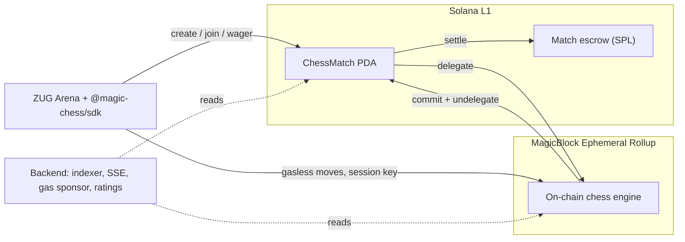

<div align="center">
  

  <h1>Magic Chess</h1>

  <p><strong>Fully on-chain chess on Solana, with gasless real-time moves on MagicBlock Ephemeral Rollups.</strong></p>

  [](https://github.com/amalnathsathyan/magic-chess/actions/workflows/ci.yml)
  [](https://amalnathsathyan.github.io/magic-chess/docs/)
  [](LICENSE)
  [](https://explorer.solana.com/address/FbXiX6xcMRPVuTc7AZkQMSbpKa1uBzQY16NFf5jhJC7h?cluster=devnet)

  **[Play ZUG Arena](https://arena.chessmagic.workers.dev)** · **[Read the docs](https://amalnathsathyan.github.io/magic-chess/docs/)**
</div>

---

Magic Chess is an Anchor program that enforces the full FIDE rules on-chain:

- castling, en passant and promotion
- check, checkmate and stalemate
- the 50-move rule, threefold repetition and insufficient material

During a game, the match account is delegated to a MagicBlock Ephemeral Rollup. Moves there confirm in milliseconds and cost no gas. Session keys remove wallet popups. Wagers stay in a program-owned escrow on Solana L1 and pay out when the game ends.

**ZUG Arena** is the web app built on it. You sign in with Privy, a sponsor pays transaction fees, and the app adds:

- live spectating with points-based move predictions
- Elo ratings and player profiles
- game history and replays

> **Devnet only.** Magic Chess has not been externally audited. See [SECURITY.md](SECURITY.md).

## How it works


```mermaid
flowchart LR
    subgraph L1["Solana L1"]
        Escrow["Match escrow (SPL)"]
        Match["ChessMatch PDA"]
    end
    subgraph ER["MagicBlock Ephemeral Rollup"]
        Engine["On-chain chess engine"]
    end
    App["ZUG Arena + @magic-chess/sdk"] -->|create / join / wager| Match
    Match -->|delegate| Engine
    App -->|gasless moves, session key| Engine
    Engine -->|commit + undelegate| Match
    Match -->|settle| Escrow
    Backend["Backend: indexer, SSE, gas sponsor, ratings"] -.->|reads| Match
    Backend -.->|reads| Engine
```

1. White creates a match and locks a wager (or plays for free). Black joins and matches it.
2. The match is delegated to the rollup. Both players move there with no fees.
3. When the game ends by checkmate, resignation, timeout or a draw rule, the state returns to L1. Settlement then pays the winner, minus a 1% fee, or splits the pot on a draw.

Details: [Architecture overview](https://amalnathsathyan.github.io/magic-chess/docs/architecture/overview).

## Repository layout

| Path | What it is |
|------|------------|
| [`magic-chess-program/`](magic-chess-program) | Anchor 1.1.2 program (Rust). Covers the chess engine, escrow and settlement, MagicBlock delegation, session keys and the prediction pool. |
| [`sdk/`](sdk) | `@magic-chess/sdk`: a TypeScript client with base/rollup routing, React hooks and PDA and FEN helpers |
| [`frontend/`](frontend) | ZUG Arena: a Next.js 15 static export on a Cloudflare Worker, using Privy and Tailwind 4 |
| [`backend/`](backend) | Fastify + Postgres. Runs the chain indexer, realtime SSE hub, gas sponsor, ratings and move predictions. |
| [`docs/`](docs) | Docusaurus source for the [docs site](https://amalnathsathyan.github.io/magic-chess/docs/) |
| [`research/`](research) | Earlier R&D notes and design docs, kept for reference and no longer maintained |

## Quick start

Prerequisites:

- Node.js 22
- Rust 1.89 (pinned in `rust-toolchain.toml`)
- Solana CLI
- Anchor CLI 1.1.2

```bash
git clone https://github.com/amalnathsathyan/magic-chess.git
cd magic-chess

# Program: build and test
cd magic-chess-program
cargo build-sbf --tools-version v1.52
cd programs/magic_chess
cargo test --test unit_tests                                         # 182 unit tests
cargo test -- litesvm                                                # LiteSVM integration
cargo test --test payout_full_flow                                   # payout flows
cargo test --features integration-tests --test cu_benchmarks         # compute-unit benchmarks

# SDK
cd ../../../sdk && npm install && npm test

# Backend (needs Postgres; see backend/.env.example)
cd ../backend && npm ci && cp .env.example .env && npm run dev

# Frontend
cd ../frontend && npm ci && npm run dev
```

The full guide is [Local setup](https://amalnathsathyan.github.io/magic-chess/docs/getting-started/local-setup).

## Documentation

- [How to play](https://amalnathsathyan.github.io/magic-chess/docs/getting-started/how-to-play)
- [Program reference](https://amalnathsathyan.github.io/magic-chess/docs/architecture/program): accounts, instructions and errors
- [MagicBlock integration](https://amalnathsathyan.github.io/magic-chess/docs/architecture/magicblock)
- [TypeScript SDK](https://amalnathsathyan.github.io/magic-chess/docs/build/sdk)
- [Building agents](https://amalnathsathyan.github.io/magic-chess/docs/build/agents)
- [Security reviews](https://amalnathsathyan.github.io/magic-chess/docs/security/overview)
- [Roadmap](https://amalnathsathyan.github.io/magic-chess/docs/roadmap)

## Contributing

Contributions are welcome. Read [CONTRIBUTING.md](CONTRIBUTING.md) and the [Code of Conduct](CODE_OF_CONDUCT.md), and target the `dev` branch. Report security issues privately as described in [SECURITY.md](SECURITY.md).

## License

[MIT](LICENSE)
