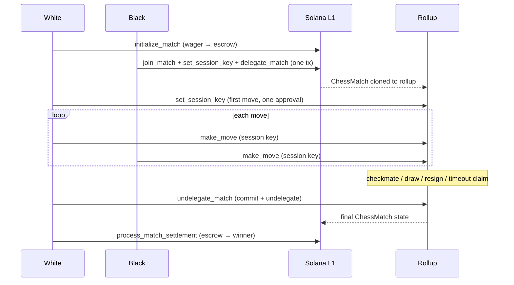

# MagicBlock integration

Magic Chess plays games on a [MagicBlock Ephemeral Rollup](https://docs.magicblock.gg)
(ER). The `ChessMatch` account is **delegated** to a rollup validator, the same
program runs there, and moves confirm in milliseconds with no transaction fees.
When the game ends the account is committed and returned to Solana, where the
escrow pays out.

## Why a rollup

| | Solana L1 | Ephemeral Rollup |
| --- | --- | --- |
| Move confirmation | ~400 ms+ | tens of ms |
| Fee per move | base fee + priority | none |
| Wallet prompt per move | yes, unless a session key | no (session key) |
| Holds tokens | yes (escrow) | no |

## Lifecycle



### 1. Delegate

`delegate_match` runs on L1 and must be signed by a player (anyone may pay the
rent). ZUG Arena bundles it into Black's join transaction, so the match is on
the rollup as soon as it starts. The SDK exposes it as
`client.delegateMatch(matchId)`, which waits until the router reports the
delegation and returns the rollup endpoint.

### 2. Route to the right validator

Delegated accounts live on a specific validator. The SDK asks the MagicBlock
router where an account lives and sends there:

```ts
import { getDelegationStatus, getERConnection, resolveAccountRuntime } from "@magic-chess/sdk";

const status = await getDelegationStatus(chessMatchPda); // { isDelegated, fqdn, ... }
const er = getERConnection(status.fqdn!);
```

`MagicChessClient` does this for you on every rollup call and caches the
connection per match.

### 3. Play with session keys

`make_move` accepts three kinds of signer for the side to move:

1. the player's wallet,
2. the `session_signer` that player registered with `set_session_key`, if not expired,
3. a gum `SessionTokenV2` (MagicBlock session-keys program).

ZUG Arena uses option 2. It generates a keypair per match and wallet, stores it
in `localStorage`, and registers it for 24 hours (the program allows up to 7
days). Black registers in the join transaction. White registers on the first
move with one approval. Session keys can only move. Resigning, claiming a
timeout and settling still need the player's wallet, which embedded Privy
wallets sign silently.

### 4. Commit and undelegate

- `commit_state` writes the rollup state back to L1 and keeps the delegation.
- `undelegate_match` commits and returns ownership to the program on L1. After
  that, L1-only instructions such as `process_match_settlement` can run.

Both run **on the rollup** and must be signed by a player. The SDK waits for
the matching commitment on L1 (`confirmCommitmentOnBase`) before returning.

## Timeouts and the crank

The program can schedule a MagicBlock task-scheduler crank
(`schedule_timeout` / `cancel_timeout_task`) to claim a timeout and settle with
no player action. **This is currently disabled.** Instead:

- the app shows the countdown and, when it hits zero, an embedded wallet claims
  the win automatically and an external wallet gets a **Claim timeout win** button;
- a player presses **Finalize and settle payout** to undelegate and settle.

Re-enabling the crank (or settling from the backend) is on the [Roadmap](../roadmap.md).

## Endpoints (devnet)

| Service | Endpoint |
| --- | --- |
| Base RPC (used by the app) | `https://rpc.magicblock.app/devnet` |
| Router | `https://devnet-router.magicblock.app/` |
| Rollup validators | `https://devnet-as.magicblock.app`, `https://devnet-eu.magicblock.app`, `https://devnet-us.magicblock.app` (picked by the router) |

## Program addresses

| Program | Address |
| --- | --- |
| Delegation program | `DELeGGvXpWV2fqJUhqcF5ZSYMS4JTLjteaAMARRSaeSh` |
| Magic program (task scheduler) | `Magic11111111111111111111111111111111111111` |
| Magic context | `MagicContext1111111111111111111111111111111` |
| Session keys (gum) | `KeyspM2ssCJbqUhQ4k7sveSiY4WjnYsrXkC8oDbwde5` |

## Gotchas

- **Blockhash and runtime must match.** Fetch the blockhash from the same
  connection you submit to. A base-layer blockhash sent to the rollup fails
  with `Blockhash not found`.
- **Delegated accounts are read-only on L1.** Read the live game from the
  rollup. `client.getMatch` and `subscribeToMatch` resolve this for you.
- **Settlement needs L1.** Undelegate first, then wait for the commitment,
  then settle.
