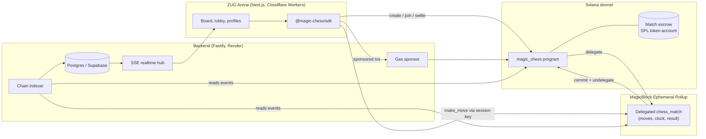
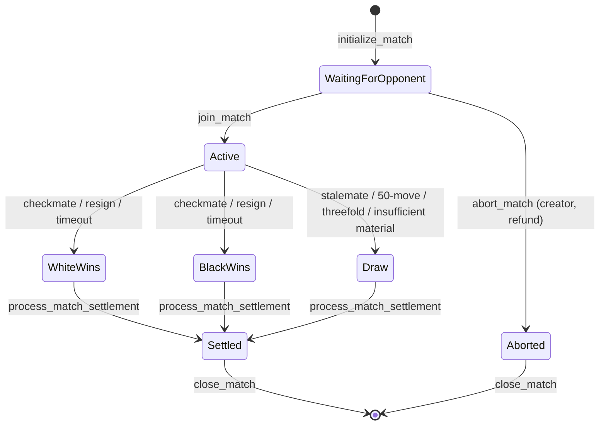

# Architecture overview

Magic Chess has four parts. Only the program is trusted. The backend and app
are conveniences that anyone can replace.

## Components

| Component | Path | Role |
| --- | --- | --- |
| **Program** | `magic-chess-program/` | Anchor program. Holds match state, enforces chess rules, escrows wagers, pays out. Source of truth. See [Program reference](./program.md). |
| **Ephemeral Rollup** | MagicBlock | Runs the same program against the delegated match account. Moves confirm in milliseconds with no fees. See [MagicBlock integration](./magicblock.md). |
| **SDK** | `sdk/` | Typed client for every instruction. Resolves whether a match lives on L1 or a rollup and sends there. See [SDK reference](../build/sdk.md). |
| **Backend** | `backend/` | Sponsors base-layer fees, indexes program events into Postgres, streams live state over SSE, computes ratings and runs move predictions. See [Backend](./backend.md). |
| **Frontend** | `frontend/` | ZUG Arena. Static Next.js export served by a Cloudflare Worker. See [Frontend](./frontend.md). |

## Where things run

| Operation | Runs on | Signed by |
| --- | --- | --- |
| `initialize_match`, `join_match`, `abort_match` | Solana L1 | Player wallet (fees sponsored for embedded wallets) |
| `delegate_match` | Solana L1 | Either player, bundled into the join |
| `set_session_key` | L1 at join, or the rollup later | Player wallet |
| `make_move` | Rollup | Session key or player wallet. No fees |
| `resign_game`, `claim_timeout_win` | Rollup | Player wallet (silent for embedded wallets). No fees |
| `commit_state`, `undelegate_match` | Rollup, which commits back to L1 | Player wallet |
| `process_match_settlement`, `close_match` | Solana L1 | Anyone (accounts are checked) |

**Tokens never leave L1.** The escrow is an SPL token account on Solana. Only
the match account is delegated, so a rollup outage cannot move funds. It can
only delay the game until the account is undelegated.

## Match lifecycle

`Settled` is not a separate status. Settlement sets `payout_processed = true`
on a finished match, and only then can `close_match` reclaim its rent.

## Trust model

- **Rules and money:** the program alone. Clients can't submit board state;
  they submit a move, and the program validates and applies it.
- **Indexed history, ratings, lobbies:** the backend. It only stores events it
  decodes from confirmed transactions of the configured program, so a client
  can't forge results. If it disappears, games still finish and settle.
- **Gas sponsor:** the backend fee payer only co-signs an allowlist of Magic
  Chess instructions after simulating them, with per-user and global budgets.
  See [Gas sponsorship](../features/gas-sponsorship.md).
- **Platform fee:** the creator sets the fee rate and fee wallet at creation.
  The joiner accepts them by joining. ZUG Arena always uses 1% and its own
  wallet. Custom clients should show these values before a player joins.
