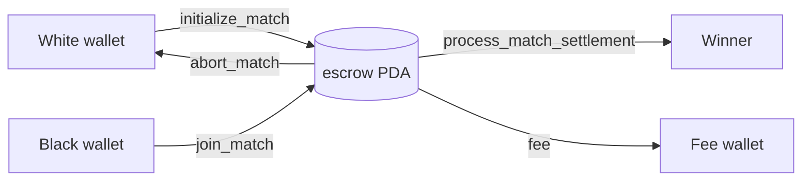

# Wagers and settlement

Every match has a wager, which can be zero. The program keeps it in an escrow
token account owned by a PDA, and only the program can move it.

## Terms set at creation

| Term | Set by | Notes |
| --- | --- | --- |
| Token mint | Creator | Any SPL Token mint. ZUG Arena defaults to WSOL |
| Amount per player | Creator | Raw token units. `0` = free match |
| Per-move time limit | Creator | Seconds. ZUG Arena offers 60, 180 and 600 |
| Platform fee | Creator | Basis points, max 10 000. ZUG Arena uses 100 (1%) |
| Fee wallet | Creator | Receives the fee. Settlement checks the fee token account is owned by it |

The joiner must deposit exactly the same amount of the same mint
(`BetAmountMismatch` / `InvalidMintForJoin` otherwise).

## Escrow flow

## Outcomes

| Result | Payout |
| --- | --- |
| White or Black wins | Winner receives `total_pot - fee` |
| Draw | `total_pot - fee` split: White gets half rounded down, Black the rest |
| Aborted before join | Creator refunded in full, no fee |
| Free match | Nothing moves; settlement records the result and closes the escrow |

`fee = total_pot × fee_bps / 10 000`, integer division.

## Who can settle

`process_match_settlement` is permissionless. Anyone can call it once the match
is finished and back on L1, because every account is checked against the
match: player token accounts must belong to the players, all must use the match
mint, and no account can appear twice. Settlement runs once
(`PayoutAlreadyProcessed`) and closes the escrow account. Its rent goes to the
signer, or to the sponsor when the backend paid for it.

After settlement, `close_match` closes the `ChessMatch` account and returns
its rent.

## Today vs planned

Players currently press **Finalize and settle payout** in the app, which runs
`undelegate_match` on the rollup and then `process_match_settlement` on L1.
Automating this is on the [Roadmap](../roadmap.md).
